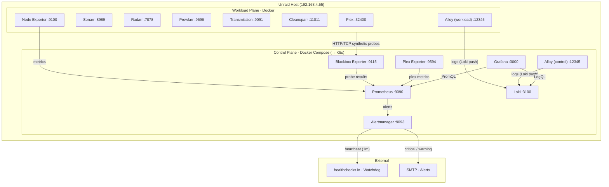

# Atlas


Atlas is a production-grade homelab platform built to senior SRE standards. It runs a self-hosted media and automation stack on Unraid, backed by a fully code-defined observability platform — multi-window SLO burn-rate alerting, structured log aggregation, synthetic probing, and a CI-validated configuration pipeline. All alerts link to runbooks. The entire stack is validated on every push via GitHub Actions.

The control plane is being actively migrated to a kubeadm Kubernetes cluster (3-node, on Unraid VMs) with Flux GitOps and External Secrets.

---

## Architecture



---

## Architecture Overview

Atlas is split into two logical planes, each deployed as a Docker Compose project (control plane migrating to Kubernetes).

### Control Plane
Responsible for observability and reliability enforcement.

| Component | Role | Port |
|---|---|---|
| Prometheus `v2.50.1` | Metrics collection & rule evaluation | `9090` |
| Blackbox Exporter | Synthetic HTTP/TCP probing | `9115` |
| Plex Exporter | Plex-specific metrics | `9594` |
| Alertmanager `v0.27.0` | Alert routing & deduplication | `9093` |
| Grafana `v10.4.3` | Dashboarding & visualisation | `3000` |
| Loki `v3.0.0` | Log aggregation | `3100` |
| Alloy | Log collection & forwarding | `12345` |

### Workload Plane
Runs on the Unraid host and provides all user-facing services.

**Infrastructure**

| Component | Role | Port |
|---|---|---|
| Node Exporter `v1.7.0` | Host metrics | `9100` |
| Alloy | Log collection & forwarding | `12345` |

**Services**

| Service | Role | Port |
|---|---|---|
| Plex | Media server | `32400` |
| Sonarr | TV show management | `8989` |
| Radarr | Movie management | `7878` |
| Transmission | Torrent download client | `9091` |
| Prowlarr | Indexer / *arr manager | `9696` |
| Cleanuparr | *arr cleanup & stale download removal | `11011` |

Each workload service is monitored via synthetic HTTP probes and infrastructure node metrics.

---

## Deployment

Deployment is handled by [`scripts/deploy.ps1`](scripts/deploy.ps1). It:

1. Copies the Alloy config to the Unraid host via `scp`
2. Deploys the **workload plane** to the Unraid Docker engine via `docker --context unraid compose`
3. Deploys the **control plane** via `docker compose` (migrating to `kubectl apply -k k8s/overlays/lab`)

```powershell
.\scripts\deploy.ps1
```

### Environment Configuration

The control plane reads two env files from `atlas/control-plane/env/`:

| File | Purpose |
|---|---|
| `.env` | Non-secret config (SMTP settings, Grafana config, Plex URL, host IPs) |
| `.secrets.env` | Secrets (SMTP password, Grafana admin password, Plex token, Watchdog URL) |

Copy the example files to get started:

```powershell
Copy-Item atlas\control-plane\env\.env.example     atlas\control-plane\env\.env
Copy-Item atlas\control-plane\env\.secrets.env.example atlas\control-plane\env\.secrets.env
```

> The Alertmanager config (`alertmanager.yml.tmpl`) is rendered at deploy time via `envsubst`, injecting values from the env files. The rendered `alertmanager.yml` is gitignored.

---

## Repository Structure

```
atlas/
├── control-plane/
│   ├── core.yml                  # Shared network & volume definitions
│   ├── env/                      # .env and .secrets.env (gitignored)
│   ├── alert/                    # Alertmanager + config template (envsubst rendered)
│   ├── observe/                  # Prometheus, Blackbox Exporter, Plex Exporter
│   │   └── configs/prometheus/
│   │       ├── prometheus.yml
│   │       ├── rules/            # recording, watchdog, prometheus, infra, storage, services, slo
│   │       └── targets/          # node, blackbox_http, blackbox_tcp
│   ├── monitor/                  # Grafana + provisioning + dashboards
│   └── log/                      # Loki + Alloy (control-plane log collection)
│
├── workload-plane/
│   ├── core.yml                  # Shared network definition
│   ├── media/                    # Plex, Sonarr, Radarr
│   ├── download/                 # Transmission
│   ├── automation/               # Prowlarr, Cleanuparr
│   └── log/                      # Node Exporter + Alloy (workload-plane)
│
├── runbooks/                     # One file per alert, linked from alert annotations
├── scripts/
│   ├── deploy.ps1                # Docker Compose deployment (workload plane)
└── .github/workflows/
    └── validate.yml              # CI: promtool, amtool, compose config, runbook coverage
```

---

## Observability

### Metrics & Scraping

Prometheus scrapes four job types:

- **`node`** — host metrics from Node Exporter (file-based service discovery)
- **`blackbox_http`** — HTTP synthetic probes via Blackbox Exporter
- **`blackbox_tcp`** — TCP synthetic probes via Blackbox Exporter

All metrics carry consistent labels: `env`, `plane`, `host`, `service`.

### Alert Rules

Rules are evaluated every 15 seconds and split across seven files:

| File | Category | Alerts |
|---|---|---|
| `recording.rules.yml` | Pre-aggregated metrics | Node CPU/memory/network/disk/filesystem recording rules; per-service SLO error ratio windows |
| `watchdog.rules.yml` | Pipeline health | `Watchdog` (always-firing dead man's switch) |
| `prometheus.rules.yml` | Self-monitoring | `PrometheusRuleEvaluationFailures`, `PrometheusConfigReloadFailed`, `PrometheusTargetMissing`, `AlertmanagerConfigReloadFailed`, `AlertmanagerNotificationsFailed` |
| `infra.rules.yml` | Availability, Performance, Network | `HostDown`, `HostHighCpu`, `HostLowMemory`, `HostHighIoWait`, `HostNetworkInterfaceDown` |
| `storage.rules.yml` | Storage capacity | `FilesystemReadOnly`, `DiskSpaceLowWarning` (<15%), `DiskSpaceLowCritical` (<10%), `InodesLow` (<5%) |
| `services.rules.yml` | Synthetic / availability | `ServiceDown`, `ServiceHttp5xx`, `ServiceLatencyHighP95`, `BlackboxExporterDown` |
| `slo.rules.yml` | SLO burn rate | `SLOBurnRateFast` (critical, >14x), `SLOBurnRateSlow` (warning, >6x), `SLOBurnRateTrend` (info, >1x) |

**SLO target:** 99.5% availability per service (error budget = 0.5%). Multi-window, multi-burn-rate pattern per the Google SRE Workbook.

### Inhibition Rules

- `HostDown` suppresses all downstream host-level alerts (CPU, memory, disk, network) for the same host
- `BlackboxExporterDown` suppresses all synthetic probe and SLO alerts for the same environment

### Alert Routing

Alerts are routed via email with severity-based routing. `Watchdog` is routed to a dead man's switch webhook (e.g. healthchecks.io), never to email.

| Severity | Receiver | Repeat interval |
|---|---|---|
| `Watchdog` | Dead man's switch webhook | 1m |
| `critical` | `email-critical` | 1h |
| `warning` | `email-warning` | 6h |
| `info` | `email-default` | 24h |
| default | `email-default` | 6h |

Alerts are grouped by `alertname`, `service`, `host`, and `env`.

### Dashboards

Grafana is provisioned automatically with:

- **Logs** — Loki log explorer
- **Synthetic** — HTTP probe overview and drilldown
- **Unraid** — Host-level infrastructure overview

---

## Design Principles

### 1. Plane Separation

Control and workload planes are logically separated to:
- Reduce blast radius
- Improve alert clarity
- Enable independent evolution of observability vs. application concerns

### 2. Low-Noise Alerting

- Alert categorization (infrastructure, storage, service, SLO)
- Inhibition rules prevent alert storms from a single root cause
- Severity normalization (`critical` / `warning` / `info`)
- Dead man's switch (`Watchdog`) proves the pipeline is alive end-to-end
- Every alert links to a runbook

If Atlas pages, it is actionable.

### 3. Everything as Code

All configuration is version-controlled and CI-validated:

- Docker Compose (all planes and services)
- Prometheus scrape config, recording rules, and alert rules (`promtool`)
- Alertmanager routing and inhibition config (`amtool`)
- Grafana provisioning, datasources, and dashboards

The control plane can be destroyed and rebuilt from source.

### 4. Structured Metrics

All metrics carry consistent labels:

- `env` — deployment environment (e.g. `lab`)
- `plane` — logical plane (e.g. `unraid`)
- `host` — physical/VM host
- `service` — service name

This enables reliable slicing, aggregation, and long-term maintainability.


## Alert Philosophy

Atlas alerts on:

- Loss of availability
- Imminent capacity exhaustion
- Reliability budget burn
- Infrastructure degradation

Atlas does not alert on:

- Transient noise
- Non-impacting metric variance
- Redundant symptoms of a known root cause

---

## Runbooks

Every alert has a `runbook` annotation pointing to a file in `runbooks/`. Each runbook documents: symptom, impact, triage steps, mitigation, and prevention.

| Runbook | Alert(s) |
|---|---|
| [`watchdog.md`](runbooks/watchdog.md) | `Watchdog` |
| [`prometheus-rule-evaluation-failures.md`](runbooks/prometheus-rule-evaluation-failures.md) | `PrometheusRuleEvaluationFailures`, `PrometheusTargetMissing` |
| [`alertmanager-config-reload-failed.md`](runbooks/alertmanager-config-reload-failed.md) | `AlertmanagerConfigReloadFailed`, `AlertmanagerNotificationsFailed`, `PrometheusConfigReloadFailed` |
| [`host-down.md`](runbooks/host-down.md) | `HostDown` |
| [`host-high-cpu.md`](runbooks/host-high-cpu.md) | `HostHighCpu` |
| [`host-low-memory.md`](runbooks/host-low-memory.md) | `HostLowMemory` |
| [`host-high-iowait.md`](runbooks/host-high-iowait.md) | `HostHighIoWait` |
| [`host-nic-down.md`](runbooks/host-nic-down.md) | `HostNetworkInterfaceDown` |
| [`filesystem-readonly.md`](runbooks/filesystem-readonly.md) | `FilesystemReadOnly` |
| [`disk-space-low.md`](runbooks/disk-space-low.md) | `DiskSpaceLowWarning`, `DiskSpaceLowCritical` |
| [`inodes-low.md`](runbooks/inodes-low.md) | `InodesLow` |
| [`service-down.md`](runbooks/service-down.md) | `ServiceDown` |
| [`service-5xx.md`](runbooks/service-5xx.md) | `ServiceHttp5xx` |
| [`service-latency.md`](runbooks/service-latency.md) | `ServiceLatencyHighP95` |
| [`blackbox-exporter-down.md`](runbooks/blackbox-exporter-down.md) | `BlackboxExporterDown` |
| [`slo-burnrate.md`](runbooks/slo-burnrate.md) | `SLOBurnRateFast` |
| [`slo-slow-burn.md`](runbooks/slo-slow-burn.md) | `SLOBurnRateSlow`, `SLOBurnRateTrend` |
